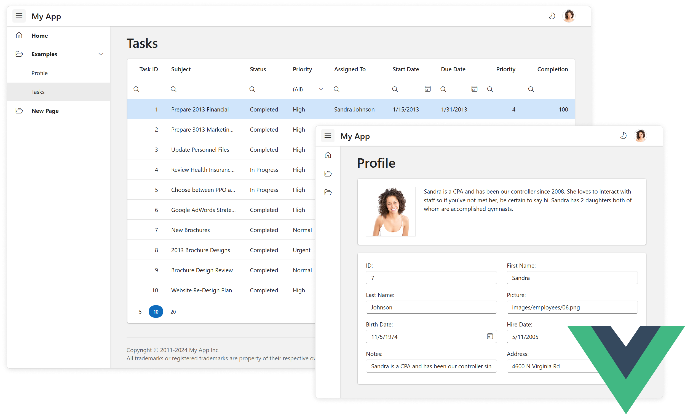

# DevExtreme Vue Template

The DevExtreme Vue Template is a Vue application with a navigation menu and sample views in a responsive layout (see a [live preview](https://devexpress.github.io/devextreme-vue-template/)). This application is created with [Vue CLI](https://cli.vuejs.org/) and uses [DevExtreme Vue components](https://js.devexpress.com/Documentation/Guide/Vue_Components/DevExtreme_Vue_Components/).

## Getting Started

For more information about the DevExtreme Vue Template and how to customize it, refer to the following help topic: [Application Template](https://js.devexpress.com/Documentation/Guide/Vue_Components/Application_Template/).

## License

**DevExtreme Vue Template is released as a MIT-licensed (free and open-source) add-on to DevExtreme.**

- [DevExtreme License](https://js.devexpress.com/Licensing/)
- [Free trial](http://js.devexpress.com/Buy/)